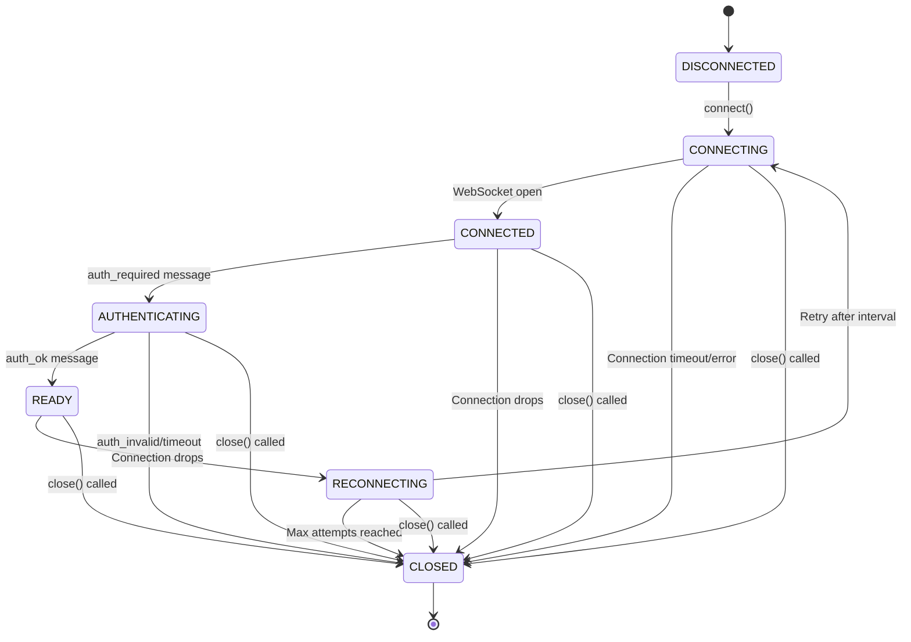

# Home Assistant WebSocket Connection - State Transition Schema

## Overview

This document describes the state transition schema for the Home Assistant WebSocket connection implementation in the n8n Home Assistant WebSocket integration.

## Connection States

The `HassConnection` class manages a WebSocket connection through the following states:

### State Definitions

| State | Description |
|-------|-------------|
| `DISCONNECTED` | Initial state, not connected to Home Assistant |
| `CONNECTING` | Attempting to establish WebSocket connection |
| `CONNECTED` | WebSocket connection established, awaiting authentication |
| `AUTHENTICATING` | Connected to server, performing authentication handshake |
| `READY` | Authenticated and ready to send/receive messages |
| `CLOSED` | Connection permanently closed, cannot be reused |
| `RECONNECTING` | Attempting to reconnect after a disconnection |

## State Transition Diagram



## Detailed State Transitions

### 1. Initial Connection Flow

```
DISCONNECTED → CONNECTING → CONNECTED → AUTHENTICATING → READY
```

**Triggers:**
- User calls `connect()` method
- WebSocket connection established
- Receives `auth_required` message from Home Assistant
- Sends authentication token and receives `auth_ok`

### 2. Connection Failure Scenarios

#### During Initial Connection
```
DISCONNECTED → CONNECTING → CLOSED
```
**Triggers:**
- Connection timeout
- WebSocket connection error
- Network failure

#### During Authentication
```
CONNECTING → CONNECTED → AUTHENTICATING → CLOSED
```
**Triggers:**
- Invalid authentication token (`auth_invalid` message)
- Authentication timeout
- Connection drops during auth process

### 3. Reconnection Flow

```
READY → RECONNECTING → CONNECTING → CONNECTED → AUTHENTICATING → READY
```

**Triggers:**
- Connection drops while in READY state
- Automatic reconnection after interval
- Successful re-establishment and re-authentication

#### Reconnection Failure
```
READY → RECONNECTING → CLOSED
```
**Triggers:**
- Maximum reconnection attempts reached
- Persistent connection failures

### 4. Manual Disconnection

```
Any State → CLOSED
```
**Triggers:**
- User calls `close()` method
- Explicit termination request

## Message Flow and Authentication

### Authentication Sequence

1. **Connection Established**
   ```
   State: CONNECTING → CONNECTED
   ```

2. **Authentication Required**
   ```
   HA → Client: { type: 'auth_required', ha_version: '...' }
   State: CONNECTED → AUTHENTICATING
   ```

3. **Send Authentication**
   ```
   Client → HA: { type: 'auth', access_token: '...' }
   ```

4. **Authentication Response**
   - **Success:**
     ```
     HA → Client: { type: 'auth_ok' }
     State: AUTHENTICATING → READY
     ```
   - **Failure:**
     ```
     HA → Client: { type: 'auth_invalid', message: '...' }
     State: AUTHENTICATING → CLOSED
     ```

## State-Dependent Behaviors

### Connection Status Methods

```typescript
isClosed(): boolean {
    return state === DISCONNECTED || state === CLOSED
}

isReady(): boolean {
    return state === READY
}
```

### Message Handling

- **READY State**: All message types are processed
- **Other States**: Only authentication-related messages are handled

### Event Emission

Each state change triggers an event emission:

```typescript
// State change events
'disconnected' | 'connecting' | 'connected' | 'authenticating' | 'ready' | 'closed' | 'reconnecting'

// Message events (only in READY state)
'message' | 'error'
```

## Configuration Parameters

| Parameter | Default | Description |
|-----------|---------|-------------|
| `timeout` | 10000ms | Connection timeout duration |
| `reconnectInterval` | 5000ms | Delay between reconnection attempts |
| `maxReconnectAttempts` | 10 | Maximum number of reconnection attempts |

## Error Handling

### Connection Errors
- **Timeout**: Transition to CLOSED state
- **WebSocket Error**: Attempt reconnection if in READY state, otherwise CLOSED
- **Parse Error**: Emit error event, maintain current state

### Authentication Errors
- **Invalid Token**: Immediate transition to CLOSED state
- **Auth Timeout**: Transition to CLOSED state after timeout period

## Socket Connection Wrapper

The `SocketConnection<T>` class provides a promise-based wrapper with states:

- `isReady`: Connection is ready for use
- `isClosed`: Connection has been terminated
- `isError`: Connection has encountered an error

This wrapper allows for asynchronous handling of connection readiness and provides a clean API for consumers.

## Implementation Notes

1. **Single Connection Instance**: Each `HassConnection` manages one WebSocket connection
2. **Event-Driven Architecture**: State changes and messages are handled through EventEmitter
3. **Graceful Degradation**: Failed connections attempt automatic recovery when possible
4. **Resource Cleanup**: WebSocket instances are properly terminated and cleaned up
5. **Logging Integration**: Configurable logging at different levels (debug, info, warn, error)

## Usage Examples

### Basic Connection
```typescript
const connection = new HassConnection(
    { host: 'localhost:8123', token: 'your-token' }
);

connection.on('ready', () => {
    console.log('Connection ready for use');
});

connection.on('closed', () => {
    console.log('Connection closed');
});

await connection.connect();
```

### With Custom Options
```typescript
const connection = new HassConnection(
    { host: 'localhost:8123', token: 'your-token' },
    {
        timeout: 15000,
        reconnectInterval: 3000,
        maxReconnectAttempts: 5,
        logger: customLogger
    }
);
```
